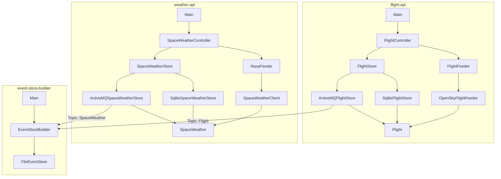
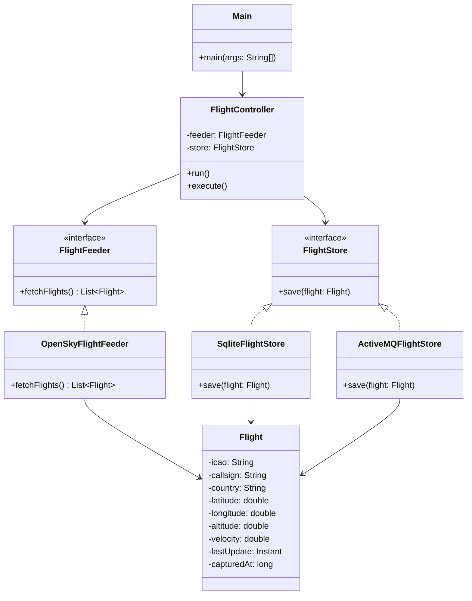
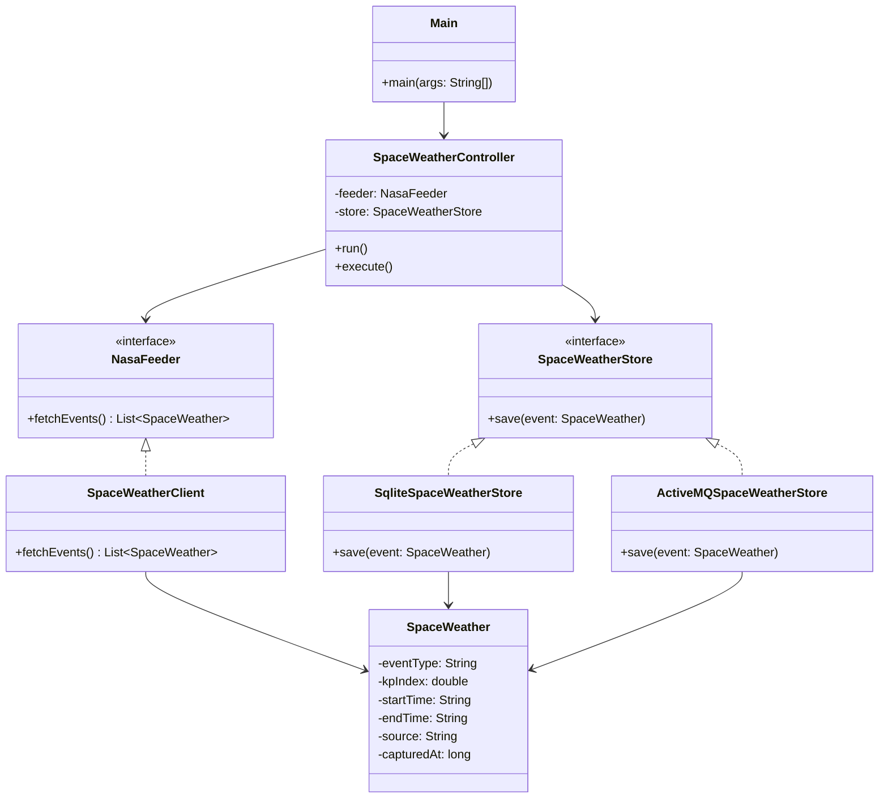
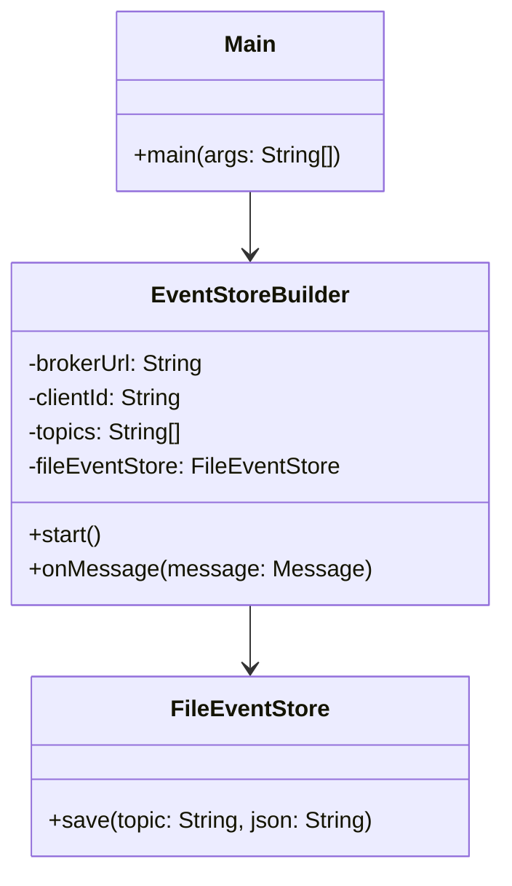

# Space Weather & Aviation Analysis — Sprint 2

## Contexto

Proyecto que analiza el impacto del **clima espacial** en la **aviación comercial**, especialmente en rutas transpolares. Se capturan datos geomagnéticos (NOAA API) y vuelos en tiempo real (OpenSky API), publicándolos en un broker de mensajería (ActiveMQ) y almacenándolos en un Event Store basado en ficheros.

> Sprint 2: implementación del patrón Publisher/Subscriber mediante ActiveMQ y Event Store Builder.

---

## Módulos

| Módulo | Responsabilidad |
|---|---|
| `flight-api` | Captura vuelos en tiempo real desde OpenSky Network y los publica en ActiveMQ |
| `weather-api` | Captura índices Kp desde NOAA y los publica en ActiveMQ |
| `event-store-builder` | Se suscribe a los topics y persiste los eventos en un Event Store basado en ficheros |

---

## Arquitectura

### Diagrama de paquetes



### Diagrama de clases — `flight-api`



### Diagrama de clases — `weather-api`



### Diagrama de clases — `event-store-builder`



---

## Event Store

Los eventos se almacenan en la siguiente estructura de directorios:

eventstore/
└── {topic}/
└── {source}/
└── {YYYYMMDD}.events

Ejemplo:

eventstore/
├── Flight/
│   └── flight-api/
│       └── 20260427.events
└── SpaceWeather/
└── weather-api/
└── 20260427.events

Cada línea de un fichero `.events` representa un evento JSON con al menos los campos:

- `ts` → timestamp del evento
- `ss` → identificador del sistema origen


## Compilar y ejecutar

### Compilar el proyecto completo

```bash
mvn install
```

### Ejecutar módulo de vuelos

```bash
cd flight-api
mvn exec:java -Dexec.mainClass="org.ulpgc.dacd.Main"
```

### Ejecutar módulo de clima espacial

```bash
cd weather-api
mvn exec:java -Dexec.mainClass="org.ulpgc.dacd.Main"
```

### Ejecutar Event Store Builder

```bash
cd event-store-builder
mvn exec:java -Dexec.mainClass="org.ulpgc.dacd.Main" -Dexec.args="tcp://localhost:61616 event-store-builder Flight,SpaceWeather"
```

> ¡¡Importante!!: El broker ActiveMQ debe estar ejecutándose en `tcp://localhost:61616`

---

## Tecnologías

- Java 21
- Maven (multimódulo)
- ActiveMQ 6.2.4
- SQLite + JDBC
- Gson
- OpenSky Network API
- NOAA Space Weather API

---

## Autores

Adrián Santana Rosales
Nira Armas Maestre