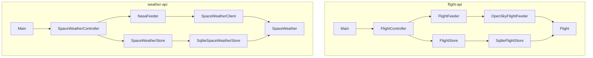
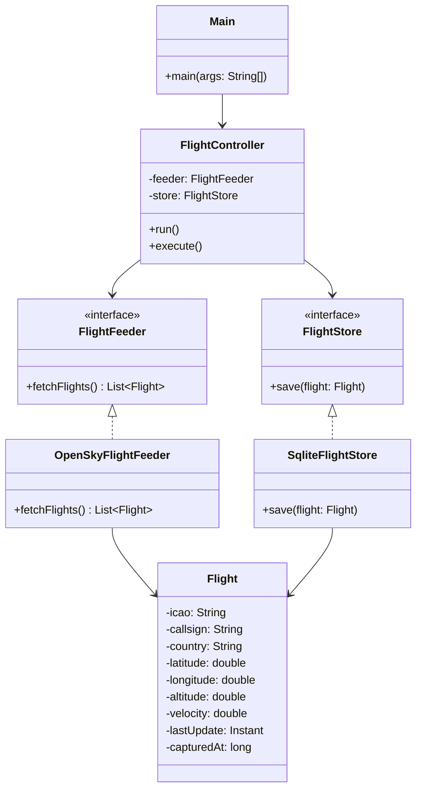
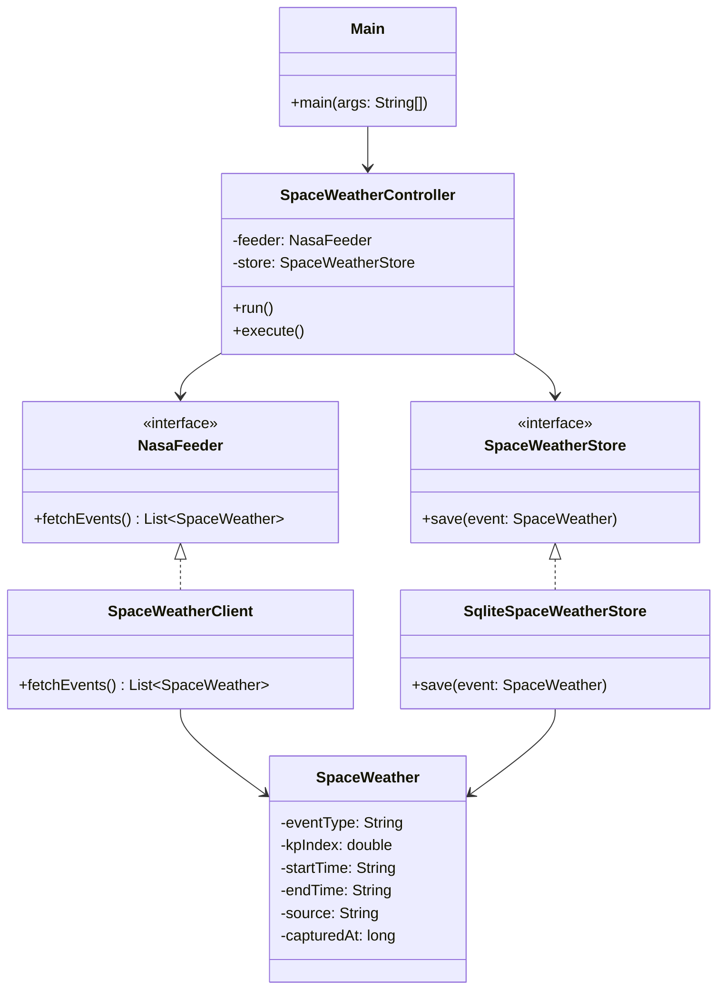

# Space Weather & Aviation Analysis — Sprint 1

## Contexto

Proyecto que analiza el impacto del **clima espacial** en la **aviación comercial**,
especialmente en rutas transpolares. Se capturan tormentas geomagnéticas (NASA DONKI API)
y vuelos en tiempo real (OpenSky API), almacenándolos de forma incremental en SQLite
para su análisis posterior.

> Sprint 1: captura y persistencia independiente de cada fuente. Sin cruce de datos.

---

## Módulos

| Módulo | Responsabilidad |
|---|---|
| `flight-api` | Captura vuelos en tiempo real desde OpenSky Network y los persiste en SQLite |
| `weather-api` | Captura tormentas geomagnéticas desde NASA DONKI API y las persiste en SQLite |

---

## Arquitectura

### Diagrama de paquetes



### Diagrama de clases — `flight-api`



### Diagrama de clases — `weather-api`



---

## Base de Datos

Base de datos compartida: `aviation.db` (SQLite)

### Tabla `flights`

| Campo | Tipo | Descripción |
|---|---|---|
| id | INTEGER | Clave primaria |
| icao | TEXT | Código ICAO |
| callsign | TEXT | Indicativo de vuelo |
| country | TEXT | País de origen |
| latitude | REAL | Latitud |
| longitude | REAL | Longitud |
| altitude | REAL | Altitud (metros) |
| velocity | REAL | Velocidad (m/s) |
| last_update | TEXT | Última actualización (ISO-8601) |
| captured_at | INTEGER | Marca temporal de captura |

### Tabla `space_weather`

| Campo | Tipo | Descripción |
|---|---|---|
| id | INTEGER | Clave primaria |
| event_type | TEXT | Identificador del evento GST |
| kp_index | REAL | Índice Kp de la tormenta |
| start_time | TEXT | Inicio del evento |
| end_time | TEXT | Fin del evento |
| source | TEXT | Fuente (NASA) |
| captured_at | INTEGER | Marca temporal de captura |

---

## Compilar y ejecutar

### Compilar el proyecto completo

```bash
mvn install
```

### Ejecutar módulo de vuelos

```bash
cd flight-api
mvn exec:java -Dexec.mainClass="org.ulpgc.dacd.Main"
```

### Ejecutar módulo de clima espacial

```bash
cd weather-api
mvn exec:java -Dexec.mainClass="org.ulpgc.dacd.Main"
```

Cada módulo se ejecuta de forma **desatendida**, capturando datos **cada hora**
automáticamente mediante `ScheduledExecutorService`.

---

## Tecnologías

- Java 21
- Maven (multimódulo)
- SQLite + JDBC
- Gson
- OpenSky Network API
- NASA DONKI API (`DEMO_KEY`)

---

## Autores

Adrián Santana Rosales — ULPGC  
Nira Armas Maestre — ULPGC  
Grado en Ciencia e Ingeniería de Datos